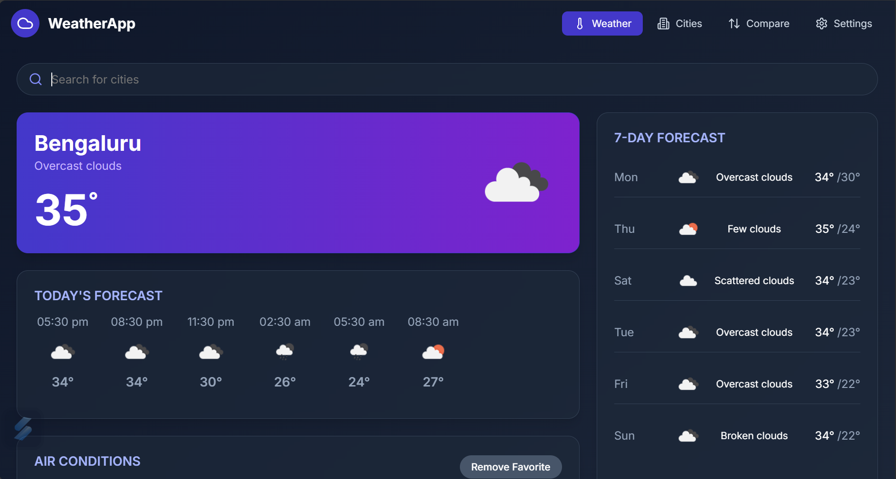
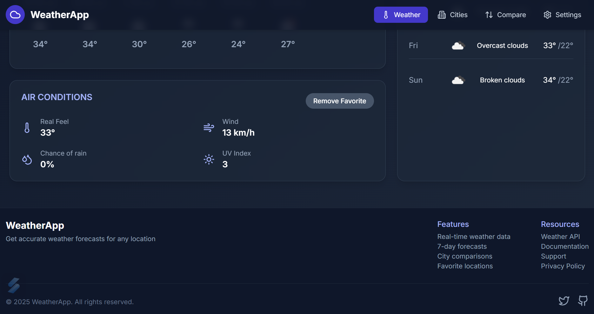
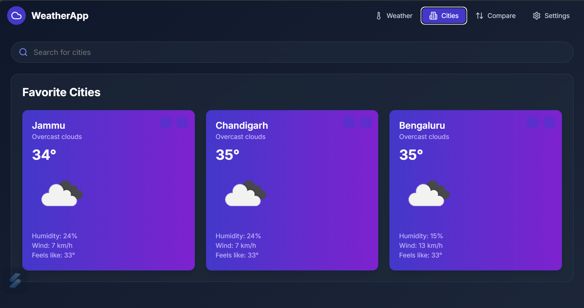
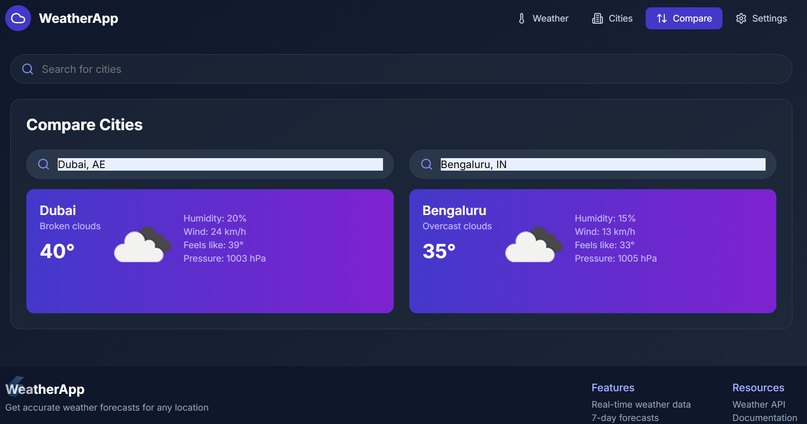
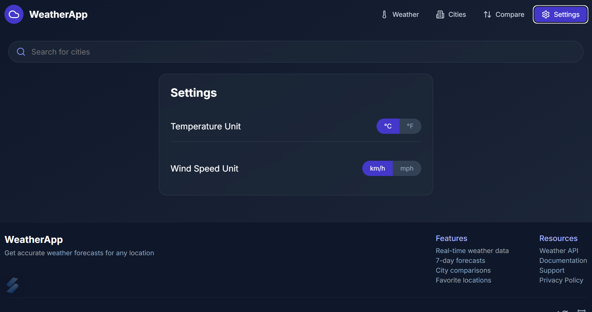

# 🌦️ Weather App

A modern, mobile-responsive weather application built using **HTML**, **CSS**, and **JavaScript**. It offers real-time weather data, side-by-side city comparisons, unit customization, and more. Designed for simplicity and usability across all devices.

---

## 🌟 Features

### 🌍 Current Weather Display  
- Search for any city and get live weather data  
- Includes temperature, humidity, wind speed, condition icons, and more

### 🆚 City Comparison  
- Compare two cities side by side  
- Instantly view their respective weather details  

### ⭐ Favorite Cities  
- Save your frequently searched cities  
- Quick access from the Favorites tab

### 🕒 Hourly & Weekly Forecast  
- View hourly breakdown and 7-day forecast (based on API limits)  

### 📏 Unit Preferences  
- Toggle between Celsius/Fahrenheit  
- Toggle between km/h and mph

### 💾 Local Storage  
- Saves your favorites and unit preferences locally  
- No login required

### 📱 Responsive Design  
- Fully optimized for mobile, tablet, and desktop  
- Clean UI for a consistent user experience

---

## 🚀 Getting Started

### 📦 Prerequisites
- Web browser (Chrome, Firefox, etc.)
- API Key from [OpenWeatherMap](https://openweathermap.org/api)

### 📥 Installation

1. Clone the repository:
   ```bash
   git clone https://github.com/AsifMohd01/weather-app.git
   ```

2. Navigate into the project folder:
   ```bash
   cd weather-app
   ```

3. Replace the API key in `script.js`:
   ```js
   const apiKey = "YOUR_API_KEY"; // Replace with your OpenWeatherMap API key
   ```

4. Open `index.html` in your browser

---

## 🛠️ Technologies Used

* **HTML5** – Markup and structure  
* **CSS3** – Layouts using Flexbox & Grid  
* **JavaScript (ES6+)** – Interactivity and API logic  
* **OpenWeatherMap API** – Real-time weather data  
* **Lucide Icons** – Clean and scalable icons  

---

## ⚠️ Limitations and Assumptions

* API rate limits may affect real-time forecasting for free-tier users  
* No backend – all settings are stored locally in browser storage  
* No login system or authentication required  
* Weekly/hourly forecasts depend on OpenWeatherMap's free-tier API support  
* Offline usage is not supported yet  

---

## 📸 Screenshots

> *(Replace placeholder paths with actual image file paths in your repo)*

### 🌤️ Home Page  
  
  

### ⭐ Favorite Cities  
  

### 🆚 Compare Cities  
  

### ⚙️ Settings  
  

---

## 🙏 Acknowledgements

* [OpenWeatherMap](https://openweathermap.org/) for weather API  
* [Lucide Icons](https://lucide.dev/) for icon assets  
* Special thanks to **HTML, CSS & JavaScript** for keeping the web simple and open  

---

## 👨‍💻 Developer

**Asif Mohd**  
📍 Jammu & Kashmir | 💻 B.Tech CSE  
🔗 [GitHub Profile](https://github.com/AsifMohd01)

> “Simple UI. Powerful features. Your personal weather companion.”
